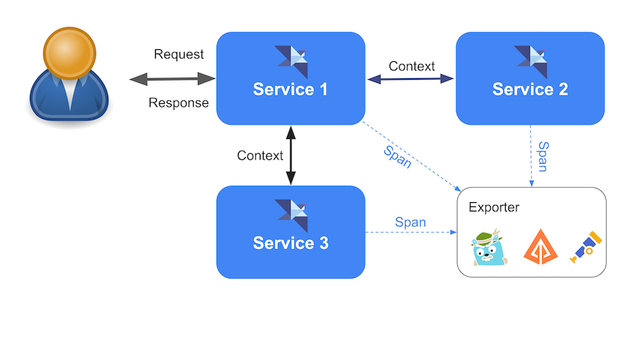
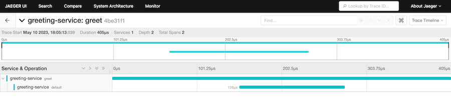
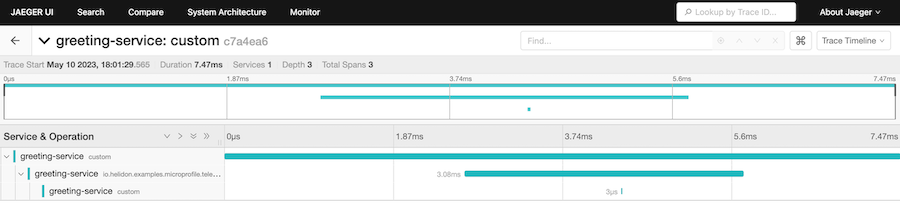
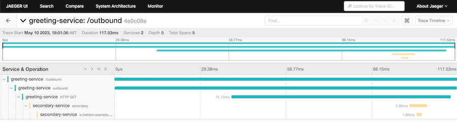

<!--@frontmatter
description: "MicroProfile Telemetry"
navigation:
  icon: i-lucide-chart-line
-->
# Telemetry

Helidon implements MicroProfile Telemetry using OpenTelemetry. It creates and
propagates traces for Jakarta RESTful Web Services and MicroProfile REST Client
requests, and it provides the OpenTelemetry APIs for manual instrumentation.

## Maven Coordinates

To enable MicroProfile Telemetry, either add a dependency on the
[Helidon MicroProfile bundle](introduction.md) or add the following dependency
to your project’s `pom.xml` (see [Managing
Dependencies](dependency-management.md)).

```xml [pom.xml]
<dependency>
  <groupId>io.helidon.microprofile.telemetry</groupId>
  <artifactId>helidon-microprofile-telemetry</artifactId>
</dependency>
```

### OTLP Exporter Dependency

Add the OpenTelemetry OTLP exporter to send traces to an OTLP-compatible
collector or observability backend.

```xml [pom.xml]
<dependency>
  <groupId>io.opentelemetry</groupId>
  <artifactId>opentelemetry-exporter-otlp</artifactId>
</dependency>
```

## Compatibility

MicroProfile Telemetry 1.1 uses the current REST span naming convention, which
includes the HTTP method. Helidon uses that convention by default. To
temporarily retain the older convention, add the following configuration:

```properties [microprofile-config.properties]
telemetry.span.name-includes-method=false
```

Helidon then uses the MicroProfile Telemetry 1.0 naming convention and logs a
warning. Support for the older format is deprecated. See
[Helidon automatic span compatibility](#helidon-automatic-span-compatibility)
for details about this setting and the response-writing compatibility setting.

## Usage

A distributed trace represents the path of one request through an application
or several services. Each trace contains one or more spans. A span describes an
operation and records its name, timing, status, and attributes. OpenTelemetry
context propagation connects spans created by different services into the same
trace.

An exporter sends completed spans to a collector or backend. Helidon uses
OpenTelemetry autoconfiguration for the exporter; the examples on this page use
OTLP.



Helidon supports both automatic and manual instrumentation:

- Automatic instrumentation creates spans for incoming Jakarta REST requests,
  outgoing Jakarta REST client requests, and MicroProfile REST Client requests.
- Manual instrumentation uses OpenTelemetry annotations and APIs from your
  application code.

### Using `@WithSpan`

Add `@WithSpan` to a method on a CDI bean to create a span when the method is
invoked. Use `@SpanAttribute` on method parameters to add attributes to that
span.

<!--@mdc ::code-callout -->
```java
@ApplicationScoped
class GreetingService {

    @WithSpan // <1>
    void refreshGreeting() {
        // Update the greeting.
    }

    @WithSpan("personalized-greeting") // <2>
    String greeting(@SpanAttribute("name") String name) { // <3>
        return "Hello " + name;
    }
}
```
1. Create a span using the default span name.
2. Create a span with an explicit name.
3. Add the method argument to the span as an attribute.
<!--@mdc :: -->

### Working With Tracers

Helidon makes `io.opentelemetry.api.OpenTelemetry` and
`io.opentelemetry.api.trace.Tracer` available for CDI injection. Use a `Tracer`
to create spans manually.

<!--@mdc ::code-callout -->
```java
@Path("/tasks")
public class TaskResource {

    @Inject
    Tracer tracer; // <1>

    @POST
    public Response createTask() {
        Span span = tracer.spanBuilder("create-task") // <2>
                .setSpanKind(SpanKind.INTERNAL)
                .setAttribute("task.type", "standard")
                .startSpan();

        try (Scope ignored = span.makeCurrent()) { // <3>
            // Create the task.
            return Response.accepted().build();
        } finally {
            span.end(); // <4>
        }
    }
}
```
1. Inject the OpenTelemetry `Tracer`.
2. Build and start a span.
3. Make the span current while the operation runs.
4. End the span in a `finally` block.
<!--@mdc :: -->

### Working With the Current Span

Inject the current OpenTelemetry `Span`, or obtain it using `Span.current()`.

<!--@mdc ::code-callout -->
```java
@Path("/tasks")
public class TaskResource {

    @Inject
    Span span; // <1>

    @GET
    @Path("/current")
    public Response currentSpan() {
        span.setAttribute("lookup.source", "injected"); // <2>
        return Response.ok().build();
    }

    @GET
    @Path("/current/static")
    public Response currentSpanStatic() {
        Span.current().setAttribute("lookup.source", "static"); // <3>
        return Response.ok().build();
    }
}
```
1. Inject the current span.
2. Use the injected span.
3. Use `Span.current()` to access the current span.
<!--@mdc :: -->

### Working With Baggage

OpenTelemetry baggage carries application-defined key/value pairs through the
current context. Inject the current `Baggage`, or obtain it using
`Baggage.current()`.

<!--@mdc ::code-callout -->
```java
@Path("/tasks")
public class TaskResource {

    @Inject
    Baggage baggage; // <1>

    @GET
    @Path("/tenant")
    public Response tenant() {
        return Response.ok(baggage.getEntryValue("tenant.id")).build(); // <2>
    }

    @GET
    @Path("/tenant/static")
    public Response tenantStatic() {
        return Response.ok(Baggage.current().getEntryValue("tenant.id")).build(); // <3>
    }
}
```
1. Inject the current baggage.
2. Read an entry from the injected baggage.
3. Use `Baggage.current()` to access the current baggage.
<!--@mdc :: -->

### Responding to Span Lifecycle Events

Applications and libraries can register Helidon span listeners to receive
notifications at several points in a span’s lifecycle:

- Before a span starts
- After a span starts
- After a span ends
- After a span is activated
- After the activated scope closes

See the [Helidon SE span lifecycle documentation][helidon-se-docum] for details.
In a Helidon MP application, add [`@CallbackEnabled`][callbackenabled] to an
injected OpenTelemetry `Tracer` or `Span` to receive those callbacks for spans
created through that injected object.

```java
@Inject
@CallbackEnabled
Tracer tracer;
```

The callback-enabled object implements the corresponding OpenTelemetry
interface, but it is a Helidon wrapper which invokes the registered listeners.

### Controlling Automatic Span Creation

By default, Helidon MP Telemetry creates a span for each incoming Jakarta REST
request and outgoing Jakarta REST client request. Applications can selectively
suppress these automatic spans.

#### Incoming REST Requests

Implement the
[`HelidonTelemetryContainerFilterHelper` interface][helidontelemetry] to decide
whether Helidon should create a span for an incoming request. Helidon calls all
discovered helpers with the Jakarta REST
[`ContainerRequestContext`][jakarta-rest-con]. If any helper returns `false`,
Helidon suppresses the automatic span.

The helper must have a CDI bean-defining annotation, such as
`@ApplicationScoped`.

```java
@ApplicationScoped
public class CustomRestRequestFilterHelper implements HelidonTelemetryContainerFilterHelper {

    @Override
    public boolean shouldStartSpan(ContainerRequestContext requestContext) {
        return requestContext.getUriInfo().getPath().endsWith("greet");
    }
}
```

#### Outgoing REST Client Requests

Implement the
[`HelidonTelemetryClientFilterHelper` interface][helidontelemetry-client] to
decide whether Helidon should create a span for an outgoing request. Helidon
calls all discovered helpers with the Jakarta REST
[`ClientRequestContext`][jakarta-rest-client]. If any helper returns `false`,
Helidon suppresses the automatic span.

The helper must have a CDI bean-defining annotation, such as
`@ApplicationScoped`.

```java
@ApplicationScoped
public class CustomRestClientRequestFilterHelper implements HelidonTelemetryClientFilterHelper {

    @Override
    public boolean shouldStartSpan(ClientRequestContext requestContext) {
        return requestContext.getUri().getPath().endsWith("greet");
    }
}
```

## Configuration

> [!IMPORTANT]
> MicroProfile Telemetry is disabled by default. Set
> `otel.sdk.disabled=false` in a MicroProfile Config source to enable it.

Helidon passes `otel.*` MicroProfile Config properties to the OpenTelemetry SDK
autoconfiguration support. MicroProfile Telemetry configures tracing; Helidon
disables the OpenTelemetry metrics and logs exporters unless your application
overrides those settings.

The following configuration enables tracing and exports spans using OTLP over
HTTP/protobuf:

```properties [microprofile-config.properties]
otel.sdk.disabled=false
otel.service.name=greeting-service
otel.traces.exporter=otlp
otel.exporter.otlp.protocol=http/protobuf
otel.exporter.otlp.endpoint=http://localhost:4318
```

This configuration sets the service name recorded with exported spans, selects
the OTLP trace exporter, uses the OTLP HTTP/protobuf transport, and sends data
to a collector or backend listening on port 4318.

You can configure batching, sampling, resource attributes, headers, TLS, and
other exporter settings using the standard [OpenTelemetry Java SDK
configuration][opentelemetry-config].

### Helidon Automatic Span Compatibility

Helidon supports the following deprecated vendor-specific compatibility
settings for automatic incoming REST request spans:

| Property | Type | Default | Description |
|----------|------|---------|-------------|
| `telemetry.span.name-includes-method` | `Boolean` | `true` | **Deprecated.** Whether the span name includes the HTTP request method. |
| `telemetry.span.full.url` | `Boolean` | `true` | **Deprecated.** Whether the span name includes the absolute request URL instead of the matched route. |
| `telemetry.span.includes-response-write` | `Boolean` | `true` | **Deprecated.** Whether the span includes preparing and writing the response entity. |

Earlier Helidon 4 releases used OpenTelemetry semantic conventions which did
not include the HTTP method in automatic incoming REST span names. Setting
`telemetry.span.name-includes-method` to `false` selects the older convention
and causes Helidon to log a warning. Leaving it unset or setting it to `true`
uses the current convention, which includes the method. The setting is
deprecated because a future major release will use the current span naming
convention unconditionally.

By default, automatic incoming REST span names use the absolute request URL.
Setting `telemetry.span.full.url` to `false` uses the matched route instead.
This setting is deprecated for removal in a future major release, and Helidon
logs a warning if it is present in the configuration.

By default, Helidon ends the incoming REST span after response serialization
and encoding, when the last byte has been buffered for writing to the socket.
Setting `telemetry.span.includes-response-write` to `false` ends the span before
serializing the response entity, preserving the behavior of earlier Helidon 4
releases. This setting is also deprecated for removal in a future major release.
Helidon logs a warning if the setting is present in the configuration.

For `telemetry.span.includes-response-write`, `true` measures the
server-side work of preparing the response. It does not measure network delivery
or wait for the client to receive or acknowledge the response.

### OpenTelemetry Java Agent

If the application runs with the OpenTelemetry Java agent, set the following
property so Helidon explicitly reuses the OpenTelemetry instance configured by
the agent:

```properties [microprofile-config.properties]
otel.agent.present=true
```

## OTLP Example

The following example exports traces from a Helidon MP application to an
OTLP-compatible backend. Jaeger is one possible backend: configure Jaeger to
receive OTLP over HTTP on port 4318 and open its UI on port 16686. See the
[Jaeger getting started documentation][jaeger-getting-started] for current
setup instructions.

Helidon exports OTLP directly to the backend’s OTLP endpoint; no Jaeger-specific
exporter is involved.

Add both the Helidon MP Telemetry dependency and the OpenTelemetry OTLP exporter
dependency shown in [Maven Coordinates](#maven-coordinates). Then add the OTLP
configuration shown in [Configuration](#configuration).

### Tracing at Method Level

Use `@WithSpan` to add an application span around a method.

<!--@mdc ::code-callout -->
```java
@Path("/greet")
public class GreetResource {

    @GET
    @WithSpan("default") // <1>
    public String getDefaultMessage() {
        return "Hello World";
    }
}
```
1. Create an application span named `default`.
<!--@mdc :: -->

Call the endpoint:

```shell [Terminal]
curl localhost:8080/greet
Hello World
```

If Jaeger is receiving the OTLP data, select `greeting-service` in the Jaeger
UI to inspect the trace.



### Adding a Custom Span

Inject an OpenTelemetry `Tracer` to add a span manually.

<!--@mdc ::code-callout -->
```java
@Inject
Tracer tracer; // <1>

@GET
@Path("custom")
@Produces(MediaType.APPLICATION_JSON)
@WithSpan
public JsonObject useCustomSpan() {
    Span span = tracer.spanBuilder("custom") // <2>
            .setSpanKind(SpanKind.INTERNAL)
            .setAttribute("attribute", "value")
            .startSpan();
    try (Scope ignored = span.makeCurrent()) {
        return Json.createObjectBuilder()
                .add("Custom Span", span.toString())
                .build();
    } finally {
        span.end(); // <3>
    }
}
```
1. Inject the OpenTelemetry `Tracer`.
2. Create and start a custom span.
3. End the span after the operation completes.
<!--@mdc :: -->



### Propagating a Trace Between Services

Automatic client instrumentation propagates the OpenTelemetry context when one
service invokes another using a Jakarta REST client or MicroProfile REST Client.
The receiving service creates its server span as a child in the same trace.

```java
@Uri("http://localhost:8081/secondary")
WebTarget target;

@GET
@Path("/outbound")
@WithSpan("outbound")
public String outbound() {
    return target.request()
            .accept(MediaType.TEXT_PLAIN)
            .get(String.class);
}
```

The secondary service can add its own application span:

```java
@GET
@WithSpan
public String getSecondaryMessage() {
    return "Secondary";
}
```

The result is a single distributed trace containing the client, server, and
application spans.



The complete example is available in the [Helidon examples
repository][helidon-example].

## Reference

- [MicroProfile Telemetry 1.1 specification][microprofile-telemetry]
- [OpenTelemetry documentation](https://opentelemetry.io/docs/)
- [OpenTelemetry Java manual instrumentation][opentelemetry-manual]

[helidon-se-docum]: https://helidon.io/docs/latest/se/tracing#span-lifecycle
[callbackenabled]: https://helidon.io/docs/latest/apidocs/io.helidon.microprofile.telemetry/io/helidon/microprofile/telemetry/CallbackEnabled.html
[helidontelemetry]: https://helidon.io/docs/latest/apidocs/io.helidon.microprofile.telemetry/io/helidon/microprofile/telemetry/spi/HelidonTelemetryContainerFilterHelper.html
[jakarta-rest-con]: https://jakarta.ee/specifications/restful-ws/3.1/apidocs/jakarta.ws.rs/jakarta/ws/rs/container/containerrequestcontext
[helidontelemetry-client]: https://helidon.io/docs/latest/apidocs/io.helidon.microprofile.telemetry/io/helidon/microprofile/telemetry/spi/HelidonTelemetryClientFilterHelper.html
[jakarta-rest-client]: https://jakarta.ee/specifications/restful-ws/3.1/apidocs/jakarta.ws.rs/jakarta/ws/rs/client/clientrequestcontext
[opentelemetry-config]: https://opentelemetry.io/docs/languages/java/configuration/
[opentelemetry-manual]: https://opentelemetry.io/docs/languages/java/api/
[jaeger-getting-started]: https://www.jaegertracing.io/docs/latest/getting-started/
[helidon-example]: https://github.com/helidon-io/helidon-examples/tree/dev-27.x/examples/microprofile/telemetry
[microprofile-telemetry]: https://download.eclipse.org/microprofile/microprofile-telemetry-1.1/tracing/microprofile-telemetry-tracing-spec-1.1.pdf
